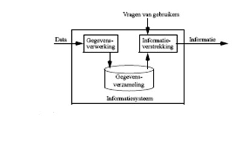

* [Inleiding](inleiding.md)
* [Logische en fysische gegevens](gegevens.md)
* [Entiteit-Relatie diagramma](er.md)
* [Relationele databases](relationeel.md)
* [Normalisatie](normalisatie.md)

# Inleiding

In een informatiesysteem worden grote hoeveelheden gegevens verwerkt en opgeslagen. Het doel
daarvan is de gebruikers van dat systeem op de meest efficiënte manier van de gewenste informatie te
voorzien.

Informatie wordt geproduceerd naar aanleiding van vragen of opdrachten van gebruikers. De gegevens
die daarvoor nodig zijn, zijn in een gegevensverzameling opgeslagen. Het zijn gegevens over personen,
zaken, feiten, gebeurtenissen ... die voor het informatiesysteem van belang zijn.

De invoergegevens zullen worden verwerkt, hetgeen betekent dat ze o.a. worden getest op geldigheid (integriteit), relevantie, ... en daarna opgeslagen. Later kan dan op vraag van gebruikers de gepaste informatie uit deze gegevensverzameling worden opgehaald.

Voorbeelden van informatiesystemen zijn  legio: goederenbeheer (met inbegrip van stockbeheer,
facturatie, ...), loonadministratie van werknemers, rekeningbeheer van banken,
bibliotheekadministratie, .... zijn de meest voor de hand liggende.
Minder zichtbare vormen van informatiesystemen zijn databanken met componentgegevens in een
elektronisch simulatieprogramma, dynamisch opgestelde Internetpagina’s, File Allocation Tables van
Operating Systemen, parametersettings van programma’s (de registry), ... Zelfs tekstverwerkingprogramma’s schrijven hun bestanden in een database-vorm weg.

Hoewel informatiesystemen in principe met verschillende technologieën kunnen worden opgezet is een
efficiënt beheer zo goed als ondenkbaar zonder computer(s). In deze cursus beperken we ons dan ook
tot informatiesystemen die met computer(s) worden beheerd.

De manier hoe informatie opgeslagen wordt, hangt sterk af van de hardware die gebruikt wordt. Harde
schijven laten een andere vorm van opslag toe dan tape-drives. Om een idee te krijgen van de eisen die
verschillende soorten hardware stellen, wordt in het volgende hoofdstuk eerst een bespreking gegeven
van verschillende soorten hardware.

Bij het opstellen van een informatiesysteem is vooraf een grondige analyse nodig van  de aard en
de vorm van de opgeslagen gegevens. Hierbij moet niet alleen rekening worden gehouden met de
huidige vereisten die aan het systeem worden gesteld, maar moet voldoende aandacht worden besteed
aan mogelijke latere uitbreidingen.

Deze analyse bestaat typisch uit twee verschillende fazen, die desnoods recursief kunnen worden uitgevoerd: de informatie-analyse en de gegevensanalyse. Ook deze worden later meer in detail besproken.

Deze twee fazen komen voorafgaand aan het gestructureerd programmeren dat je in de voorbije maanden reeds gezien hebt.

Vaak is een gebrekkige of slordige analyse de oorzaak van onoverkomelijke hinderpalen later.

## Enkele definities

Voor een goed begrip van de volgende hoofdstukken, moeten we dezelfde taal spreken. Om die reden
worden hier een aantal definities gegeven van veelgebruikte termen.

Een veld (E: field) wordt gedefinieerd als de kleinste gegevenseenheid die onafhankelijk en zinvol kan
voorkomen bij het verwerken van gegevens. Het is dus een verzameling bij elkaar horende karakters.
Zo kan een veld b.v. een naam, een postcode, het nummer van een component, of een studentennummer bevatten. De gegevens in een database vormen een verzameling van velden.
Het aantal karakters waaruit een veld is samengesteld wordt de veldlengte genoemd. Deze kan vast of
variabel zijn.

Een record is een verzameling bij elkaar horende velden. Zo zouden b.v. alle persoonsgegevens van
een bepaalde student samen in één record worden opgenomen. Naast de velden kan het record ook nog andere informatie bevatten, zoals de beschrijving van de recordlengte en een pointer (wijzer) naar het eerstvolgende record (in een logische reeks).

Records die over hetzelfde onderwerp handelen, worden gegroepeerd. Een geordende verzameling van
records vormt een tabel. Zo kan de tabel Docenten alle records bevatten van de individuele docenten.
Tabellen worden doorgaans in het geheugen gebufferd. Kleinere tabellen worden wel eens in hun
geheel ingelezen, grotere tabellen worden slechts voor een deel in het geheugen gecopieerd.

Een tabel wordt fysisch weggeschreven in een bestand (E: file) op de harde schijf. Hiervoor zijn
verschillende manieren gangbaar. Soms worden alle tabellen in één enkel bestand bewaard. Andere
database-produkten verkiezen om elke tabel in een eigen bestand te steken. Soms worden aparte
bestanden gebruikt voor specifieke delen van de tabel, zoals de beschrijving van de tabel, of
indexbestanden (deze zien we later).

Bij sequentiële benadering (E: sequential access) van de gegevens in een bestand, worden de
gegevens van het begin van het bestand naar het einde gelezen. Vergelijk dit met een cassettespeler
waar je de muziekstukken van voor naar achter moet afspelen.

Bij random benadering (E: direct access) worden er willekeurig records uit het bestand gepikt en
terug geplaatst. Vergelijk dit met een CD waarbij je willekeurig muziekstukken uit de CD kan
beluisteren.

Naast het doorzoeken,  zijn het toevoegen, verwijderen, aanpassen en consistent houden van de gegevens typische basistaken die voorkomen bij gegevensbeheer. Verder kunnen we ook een onderscheid maken tussen de termen data (gegevens) en informatie.
Met data bedoelen we feiten. Zo zijn de cijfers, getallen, symbolen, karakters en woorden die je dagelijks tegenkomt verschillende vormen van data.
Informatie verwijst daarnaast ook naar de betekenis van gegevens: naast de data beschikt men ook over de betekenis die een bepaalde gebruiker aan de data toekent.
Voorbeelden van data zijn de woorden ‘Rotterdam’, ‘Vissershuis’, ‘Monet’ en het getal ‘1882’. Een voorbeeld van informatie is vervat in de zin: ‘In het museum Boijmans van Beuningen in Rotterdam bevindt zich het doek Vissershuis dat in 1882 door Monet werd geschilderd’.
De huidige computersystemen zijn vrijwel alleen in staat om op een efficiente manier data te beheren. Dit heeft rechtstreeks geleid tot de term database die we als volgt kunnen omschrijven:

> Een database is een collectie van persistente data.

Wat betreft het beheer van de betekenis van de data, maw. het beheer van informatie, is de beschikbare databasetechnologie momenteel nog ontoereikend. Huidig onderzoek rond databases richt zich erop om te komen tot semantisch rijke datamodellen, met als ultieme doelstelling het ontwikkelen van meer geavanceerde systemen die volwaardige informatiebases kunnen beheren. 
