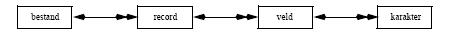

# Fysische en logische gegevens

Welke soort gegevens kunnen er op de hardware opgeslagen worden?
Als we in de computerwereld over gegevensopslag praten, dan wordt dit hoe dan ook op het laagste
niveau gerealiseerd via een bit, afkorting van binary digit. Dergelijke binaire code is de allerkleinste
informatie-eenheid die we kennen. Ze wordt gekarakteriseerd door 2 mogelijke toestanden: 0 of 1, aan
of uit, spanning of geen spanning.

Op een extern opslagmedium wordt dit gerealiseerd door de magnetisatie van een band (tape) of schijf
(disk). Bij oudere opslagmedia als ponskaarten en -banden waren de afzonderlijke bits echt als zodanig
zichtbaar door het al of niet aanwezig zijn van een gaatje (ponsing) op een bepaalde plaats.
Indien we nu b.v. tekst willen opslaan via een computer hebben we een manier nodig om letters, cijfers,
leestekens en andere symbolen om te zetten naar binaire informatie. Omdat met een bit slechts 2
mogelijke waarden kunnen opgeslagen worden, zullen in de praktijk steeds meerdere bits
gecombineerd worden tot een grotere informatie-eenheid: een x-bit-code waarbij x groot genoeg moet
zijn om voldoende combinatie-mogelijkheden te hebben om alle cijfers, letters, symbolen ... voor te
stellen..

In de praktijk worden 8 bits gecombineerd tot een byte. Dit biedt combinatie-mogelijkheden,
hetgeen betekent dat je met één byte 256 verschillende codes kan hebben of dus evenveel karakters kan voorstellen. De informatie op gegevensdragers worden momenteel meestal georganiseerd in bytes.
Ook indien een bit fysisch moet opgeslagen worden, wordt dit slechts zelden gedaan door één bit op bv.
een harde schijf te schrijven. Aangezien de kleinste eenheid een byte is, wordt meteen een byte
gereserveerd voor het bewaren van de binaire waarde.

In het verleden werden ook andere groeperingen gebruikt voor het bewaren van de bits. Op de (nu sterk
verouderde) ponskaarten komen de bij elkaar horende bits in een zelfde kolom onder elkaar voor. Een
bitwaarde 1 wordt voorgesteld door een ponsing (gat) op die plaats, het ontbreken van een ponsing
betekent bitwaarde 0. Vermits een ponskaart 12 rijen bevatte is deze code, de Hollerith-code, dus een
12-bit code, want om één enkel karakter voor te stellen wordt er gekeken naar het al dan niet aanwezig
zijn van een ponsing op 12 verschillende posities. Met een dergelijke code zijn of 4096 codes
mogelijk, hetgeen ruim teveel is om alle gebruikelijke karakters voor te stellen.

Een andere groepering, die af en toe nog opduikt, is de EBCDIC-code (Extended Binary Coded
Decimal Interchange Code). Op dit ogenblik wordt meestal de populaire ASCII-code (American
Standard Code for Information Interchange) gebruikt.

Oorspronkelijk was de ASCII-code een 7-bit-code, hetgeen  128 verschillende codes oplevert. De
uitgebreide ASCII-code (extended ASCII) is een op standaard-ASCII gebaseerde 8-bit-code, waarmee
256 combinaties mogelijk zijn: de eerste 128 codes zijn genormeerd, maar voor de bijkomende
128 codes is dat niet het geval, waardoor er verschillende extended-ASCII varianten bestaan.

256 karakters zijn niet voldoende om alle mogelijke karakters op te slaan. Denk naast de Nederlandse
en Engelse taal ook aan het Russisch, Grieks, Japans, Chinees, Hebreeuws, Arabisch, ... Onder andere
bij PC’s werd er daarom nogal eens met code pages gewerkt, waarbij elke taal een code pagina heeft.
Op basis van een code-pagina wordt dan overgeschakeld naar een andere set van ASCII karakters.

Dit is voldoende voor Europese talen, aangezien deze weinig karakters kennen. Aparte code pagina’s
bestaan voor het Frans, Engels, Nederlands, ... Voor alfabetten die duizenden karakters kennen, zoals
het Japanse Kanji, is het niet voldoende.

Om die reden worden Unicode karakters meer en meer gebruikt. De Unicode specificatie gebruikt 2
bytes voor het encoderen van elk karakter. Dit is voldoende om de meest gangbare handelstalen te
omvatten. De huidige bestaande Unicode systemen gebruiken gelukkig consistent dezelfde definities
voor de karakters. Het is dus geen probleem om gegevens van de ene database naar de andere over te
brengen. Het nadeel van Unicode is uiteraard dat een typische database tweemaal zoveel plaats nodig
heeft. Immers: elk karakter telt  16 bits of 2 bytes.

Over het algemeen mogen we er van uitgaan dat moderne databases gebruik maken van de opslag van bytes of Unicode karakters. Deze opslag gebeurt in bestanden.

Om een record op de juiste manier te kunnen interpreteren hoort er bij elk recordtype een beschrijving
of recordlayout: de recordstructuur. Dit komt neer op de opsomming van de verschillende velden met
hun lengte en type. We zullen in de verdere hoofdstukken verschillende manieren zien hoe bestanden
intern gestructureerd kunnen worden.

## Organisatie van fysische gegevens in datatypes

De fysisch opgeslagen bytes worden in praktijk vertaald naar soorten datatypes. De kennis van deze
dataypes is zeer belangrijk voor een goede oplossing van een database probleem. Immers, het is de taak
van de analyst om de gebruikersgegevens te vertalen naar een fysisch opslagmedium.

Uiteraard is dit niet het enige criterium. Naast de keuze van de manier hoe de fysische opslag gebeurt,
moet de analyst ook rekening houden met de manier hoe de gegevens structureel benaderd moeten
worden. Dit zien we later in deze cursus. Hier bespreken we eerst de meest voorkomende soorten
datatypen.

### binaire waarden

Een binair getal krijgt de waarde 1 (True) of 0 (False). Een probleem met binaire waarden is dat ze
kleiner zijn dan één byte, maar als bit worden weggeschreven naar het opslagmedium. Om die
reden neemt een binaire waarde bijna steeds minstens één byte in beslag.

### character

Karakters worden gewoon in hun ASCII vorm op de harde schijf geschreven, en worden dan typisch
gedefinieerd als "char". Een onderscheid dient gemaakt te worden tussen de gewone ASCII karakters
en de Unicode karakters. Unicode karakters worden bv. als "nchar" gedefinieerd.

Een reeks van karakters (een string) kan zowel een vaste lengte hebben, als een variabele lengte. In
beide gevallen dient opgegeven te worden wat de maximale lengte is van de string. Indien een vaste
lengte wordt gebruikt, is definitie bv. char(30) of nchar(30). Tekstlijnen van variabele lengte worden
bv. gedefinieerd als varchar(300) of nvarchar(300).

### tekst en binaire bestanden

Een speciale vorm van string is de opslag van ganse teksten ("tekst" of "bulk"). Het gaat hierbij niet
alleen om teksten, maar bv. ook over foto’s of meetgegevens. Deze gegevens worden doorgaans
opgeslagen met een variabele lengte in een bulk formaat.

Het lijkt logisch om voor deze gegevens een varchar te gebruiken. Dit wordt echter afgeraden. Heel wat
databaseprodukten behandelen bulk data verschillend van gewone varchar data. Dit voornamelijk om
de gegevens sneller te kunnen bewaren en opzoeken.

### integer waarden

In het geval van integer waarden, worden opeenvolgende bytes geïnterpreteerd als één binair niet-decimaal cijfer. Afhankelijk van het aantal bytes dat gebruikt wordt, kunnen grotere getallen
opgeslagen worden. Doorgaans worden integers niet gedefinieerd van 0 tot de maximale waarde, maar
wordt de nul halverwege gekozen. Op die manier kunnen ook negatieve integer waarden uitgedrukt
worden.

Het aantal gebruikte bytes voor de integer, hangt af van de definitie die je geeft. In het geval van SQL
worden tinyint, smallint en integer gedefinieerd alnaargelang één, twee resp. vier bytes gebruikt worden voor het opslaan van de integer.

Voorbeelden van integer getallen zijn -27000 en 6679.

### decimale en floating-point getallen

Bij decimale getallen gebeurt de interpretatie van de bytes meer uitgebreid. Het zijn getallen met of
zonder decimaal punt, en eventueel voorafgegaan door een plus- of minteken. Het totaal aantal cijfers
wordt de precisie genoemd, en het aantal cijfers na de komma de schaal. Het maximumbereik van een
decimaal getal wordt bepaald door het aantal bytes dat voor de precisie gebruikt wordt.
Voorbeelden van decimale getallen zijn -1800,451 en 3,1415926536.

Bij floating-point getallen wordt de definitie verder uitgebreid en kan een exponent meegegeven
worden.

Voorbeelden van floating-point getallen zijn -1,44E23 en 4,8984E-160.

### datum en tijdswaarden

De meeste database-produkten voorzien een manier om data en tijden op een aparte manier weg te
schrijven. Deze datatypen worden in de praktijk zeer veel gebruikt zodat deze keuze gerechtvaardigd is.
Het probleem bij het gebruik van data, zit vooral in de jaartallen. Sommige databaseprodukten
gebruiken nog steeds twee karakters voor het jaartal.

### Andere datatypen

De bovenstaande datatypen komen zowat steeds voor, maar zijn uiteraard niet de enige. Sommige
databases voorzien speciale datatypes, zoals Sequence (Een lange integer die steeds doortelt), Image
(een bulk type, specifiek voor foto’s), Timestamp (de creatiedatum wordt meteen ingevuld),
UniqueIdentifier (een uniek nummer voor elk record) of Money. Een goede kennis van het
databaseprogramma is dan ook belangrijk.

## Organisatie van datatypes in bestanden

In een klantenbestand zitten records over alle klanten van een bedrijf. Elk record bevat gegevens over
een welbepaalde klant. Deze gegevens zitten in de verschillende velden, b.v. klantennummer, naam,
telefoon, ... Het artikelbestand bestaat uit records over artikels. Ieder artikelrecord heeft weer een aantal velden zoals artikelnummer, omschrijving, voorraad, kostprijs.

Het transactiebestand bevat informatie over bestellingen, en zal dus zowel bepaalde klantgegevens als
bepaalde artikelgegevens bevatten. 

Samenvattend is er dus een hiërarchisch verband tussen bestanden, records, velden en karakters:

De pijlen moeten als volgt geïnterpreteerd worden. Een bestand bestaat uit meerdere records. Dit wordt aangeduid met een dubbele pijl. Een record daarentegen behoort slechts tot één bestand. Dit wordt aangegeven met een enkele pijl. Een analoge redenering geldt voor velden en karakters.

Volgens gebruik onderscheidt men onder meer :

-	stambestanden (basisbestanden) : hierin staan de hoofdgegevens over het onderwerp,zoals de gegevens van de leden van een atletiekclub.
-	indexbestanden: hulpbestanden waarmee snelle toegang wordt bekomen tot hoofdbestanden.
-	mutatiebestanden (bewegingsbestanden, transactiebestanden): bevatten mutaties die op het hoofdbestand moeten worden doorgevoerd. Dit kunnen b.v. zowel gegevens zijn betreffende nieuwe leden, als te schrappen of te wijzigen gegevens.
-	werkbestanden : dienen om tussenresultaten op weg te schrijven en worden vaak na de uitvoering van het programma vernietigd.
-	historische bestanden en archiefbestanden : bevatten gegevens zoals ze waren op een bepaald tijdstip. Voordat gegevens definitief worden gewist is het b.v. wenselijk om één en ander te archiveren, mocht er later toch nog iets moeten worden opgevist.
